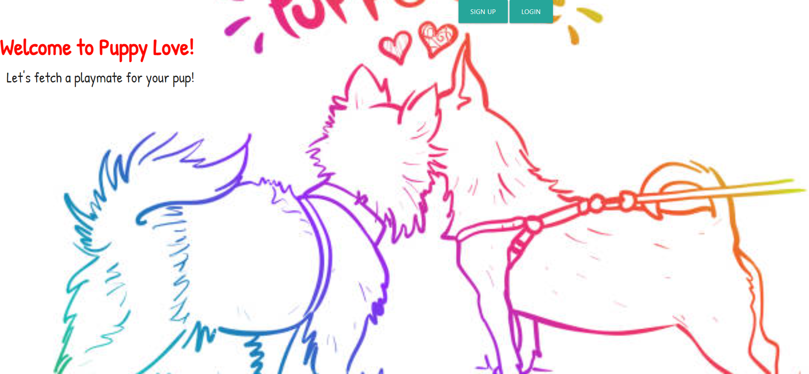
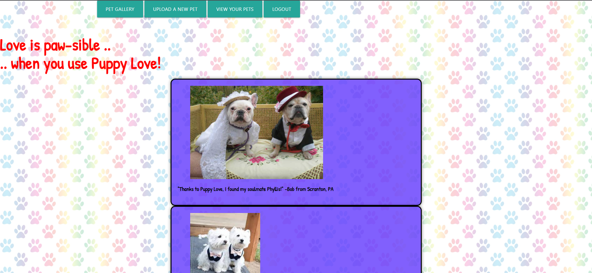
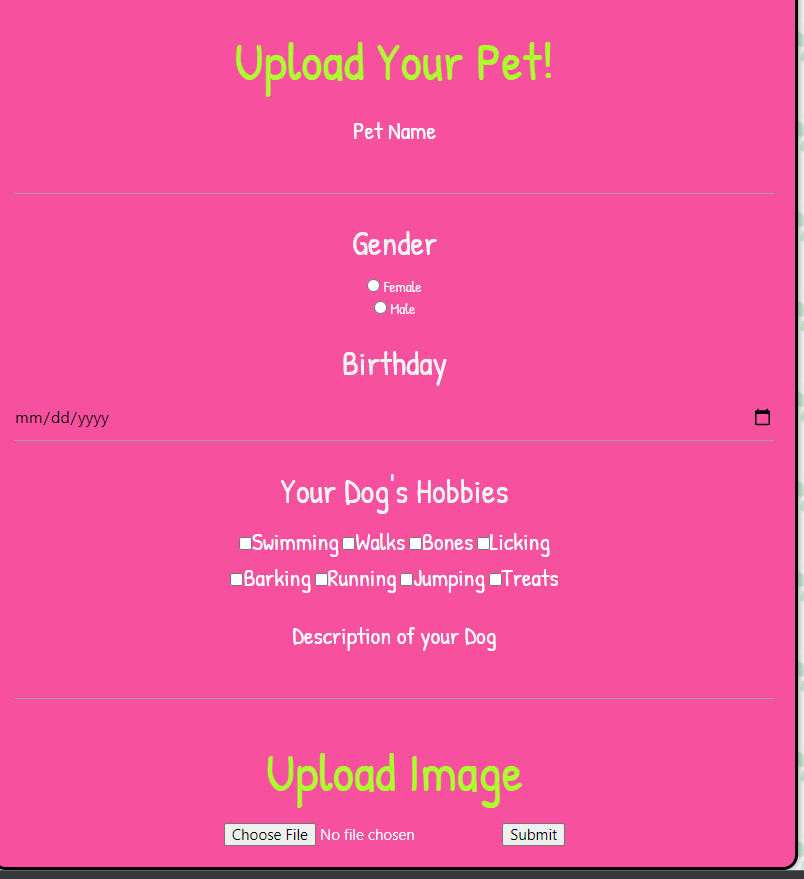
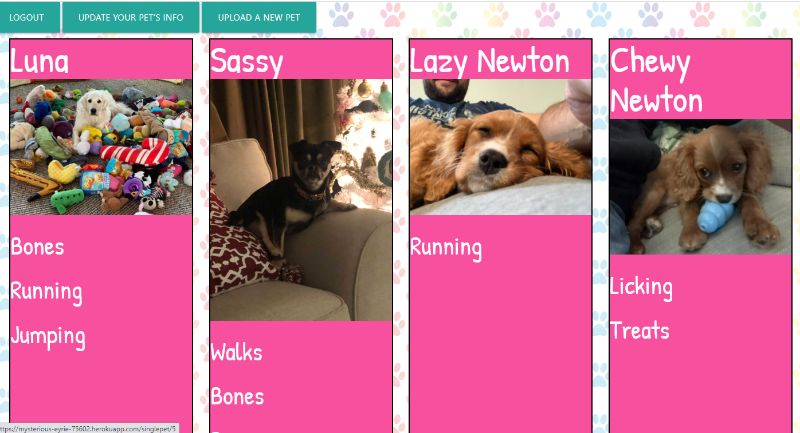

# Puppy-Love

## Description

What: Our motivation for this project was to provide a puppy dating site where a user could upload their pets to the site and find other users' pets. Our efforts have allowed the user to login and create multiple pets with their own name, gender, birthday, likes, and aboutme biography. The user can then choose to update or delete their pets' information, with the changes reflecting on the site and the database. The user can also view the pet gallery, to see all pets. When the user clicks on the desired pet, it brings the user to that pets' profile page. Our project should stand out for its unique concept.

## Table of Contents

* [Installation](#installation)
* [Usage](#usage)
* [Credits](#credits)
* [License](#license)
* [Badges](#badges)
* [Features](#features)
* [Contributing](#contributing)
* [Tests](#tests)

## Installation

No installation required. Follow the link listed under Usage below or in the Description above.

## Usage

* [Link to Webpage](https://github.com/Zsvoboda87/Puppy-Love)

After logging in, the user is greeted by a pet gallery where they can view all of the pets that have been added to the database by themselves and other users.

A user can upload their pet via the Upload Pet button, where they are able to add the pet's name, birthday, gender, likes, image, and about me section.

The user is able to view their own pets via the view your pets tab. In the future, we plan on adding the ability to update a user's pets.

## Credits

* [Shields.io Link](https://shields.io/): Used to create My Shield found in Badges below.
* [License Link](https://choosealicense.com/licenses/mit/): Used to determine and copy the correct license for the project found in License below and the LICENSE.txt file.
* [Contributor Covenant Link](https://www.contributor-covenant.org/version/2/1/code_of_conduct/code_of_conduct.md): Used to obtain a proper code of conduct for contribution found in Contributing below.
* [Markdown Guide](https://www.markdownguide.org/basic-syntax/): Used to setup the format of the README.md.
* [NPM Multer](https://www.npmjs.com/package/multer): Used to allow the user to upload their own image and have it saved to the database.
* [Youtube](https://www.youtube.com/): Used for tutorials for using npm multer.
* [Diana](https://github.com/2332fun/): Made the model for Pet.js, made the index.js and petTest.js seed, made the README.md, made the owner-routes.js and pet-routes.js, worked on petUpdate functionality.
* [Savannah](https://github.com/Savannahpolcen/): Worked on routes/handlebars with Maria, helped with the layout of the website. Made the layout of the navigation bar and hooked the handlebars to the buttons on it.
* [Maria](https://github.com/mtornabene05/): Made the handlebars, worked on routes/handlebars with Savannah. Used materialize to format and style the website.
* [Zachary](https://github.com/Zsvoboda87/): Lead the project, setup the initial layout of the files, made the schema.sql, connection.js, and index.js for routes. Made the owner-routes.js, dashboard-routes, home-routes.js, and index.js within controllers.

## License

MIT License

Copyright (c) [2022] [Diana Taylor, Maria Tornabene, Savannah Polcen, Zachary Svoboda]

Permission is hereby granted, free of charge, to any person obtaining a copy
of this software and associated documentation files (the "Software"), to deal
in the Software without restriction, including without limitation the rights
to use, copy, modify, merge, publish, distribute, sublicense, and/or sell
copies of the Software, and to permit persons to whom the Software is
furnished to do so, subject to the following conditions:

The above copyright notice and this permission notice shall be included in all
copies or substantial portions of the Software.

THE SOFTWARE IS PROVIDED "AS IS", WITHOUT WARRANTY OF ANY KIND, EXPRESS OR
IMPLIED, INCLUDING BUT NOT LIMITED TO THE WARRANTIES OF MERCHANTABILITY,
FITNESS FOR A PARTICULAR PURPOSE AND NONINFRINGEMENT. IN NO EVENT SHALL THE
AUTHORS OR COPYRIGHT HOLDERS BE LIABLE FOR ANY CLAIM, DAMAGES OR OTHER
LIABILITY, WHETHER IN AN ACTION OF CONTRACT, TORT OR OTHERWISE, ARISING FROM,
OUT OF OR IN CONNECTION WITH THE SOFTWARE OR THE USE OR OTHER DEALINGS IN THE
SOFTWARE.

## Badges

## Features

The website has a login that encrypts the users password in the database. The website allows an owner to have multiple pets uploaded.

## Contributing

If you are interested in contributing to this project, please read the contributor covenant found at [Contributor Covenant Link](https://www.contributor-covenant.org/version/2/1/code_of_conduct/code_of_conduct.md). Then email one of us at <mirachan2332@gmail.com>, <Mtornabene05@gmail.com>, <savannahpolcen@gmail.com>, or <svobodazachary@gmail.com> to further collaborate.

## Tests

No test provided for this specific project.

